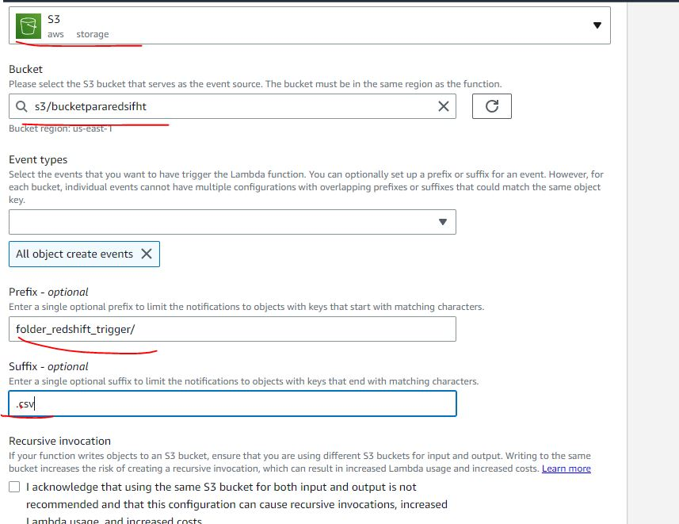
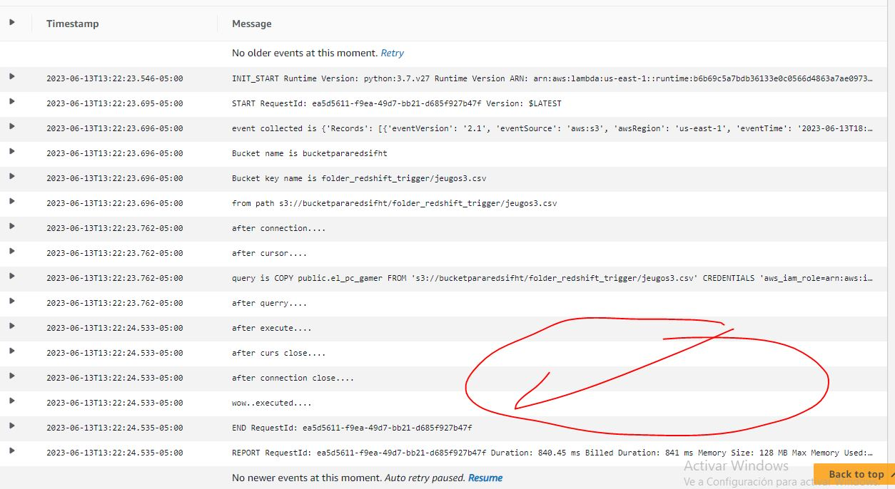

# aws_auto_data_pipeline

A data pipeline that automatically COPIES the csv's uploaded to an S3 bucket's folder into a Redshift's table through a VPC in which Redshift and the Lmdba function exist  .

1st step was to create an S3 folder which will contain the csv's that are going to be copied into redshift.

2nd Create the roles for the lambda function (s3 full acces, ec2, cloudwatch), S3, Redshift.

3rd step is to create a lambda function, on the lambda UI we have to change the timeout, add the trigger which is S3, add the permissions, edit the VPC (should be the same VPC of the Redshift cluster), create event notifications, and ad the Layer necessary to run the cod Psycopg2.

4th Code on the lambda function which will grab the new csv's and copy them into the redshift table, appending the data to the table.

5th Create a table in redshift

6th PULL THE TRIGGER

 a) Add a new CSV into the S3 bucket/folder/
 b) Monitor logs on Lambda
 

 b.1) This were the old rows
 
 
 
 c) Check for the new columns on Redshift

 
